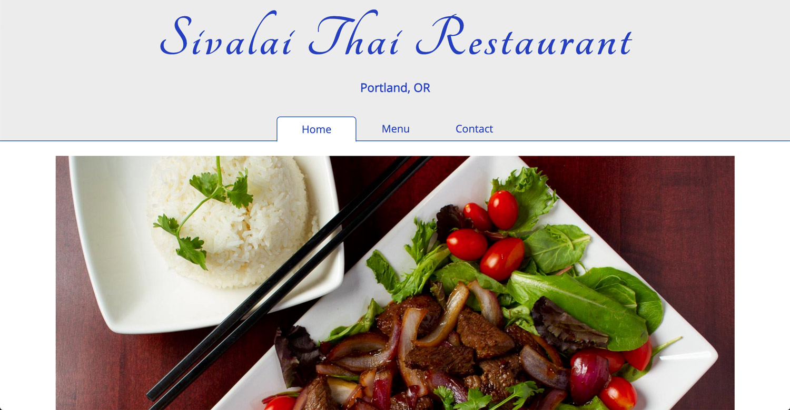

# _Restaurant Page_

#### This is restaurant website for a local Thai Restaurant in Portland, Oregon. This was made almost entirely using Javascript for the user interface and content.

#### _07/2021_

#### By _**Chris Korsak**_

## Description

This restaurant page application is a project from [The Odin Project](https://www.theodinproject.com/paths/full-stack-javascript/courses/javascript/lessons/restaurant-page) full-stack Javascript course. It notably uses javascript modules for each site _tab/page_. All of the separate javascript modules are bundled together into a single distribution file using an NPM package called _Webpack_.

Additionally, all photography in this project is my own from previous food photography assignments as a commercial photographer.




## Setup/Installation Requirements

* Clone this repository
* Make sure you have [npm](https://www.npmjs.com/) installed on your machine
* To install dependencies, navigate to project folder on your machine after downloading and run: 
```$ npm install ```
* This application is also hosted on Github pages. Check out the app [here!](https://chriskorsak.github.io/restaurant-page/)

## Technologies Used

* HTML
* CSS
* Javascript (including modules, webpack, npm, and npm gh-pages package)

## License

Website: Copyright (c) 2021 **_Chris Korsak_** All rights reserved.
Photography: Copyright (c) 2018 **_Chris Korsak_** All rights reserved.
  
